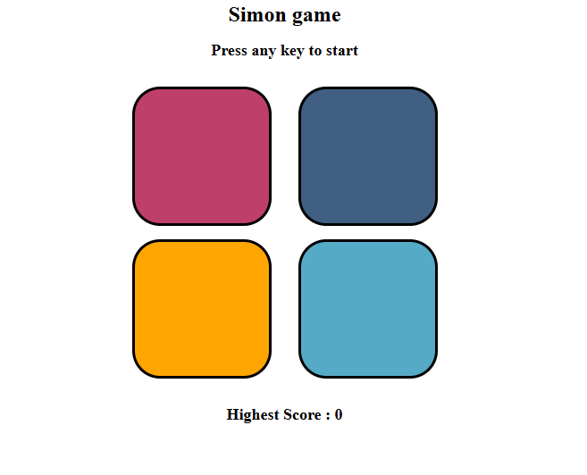
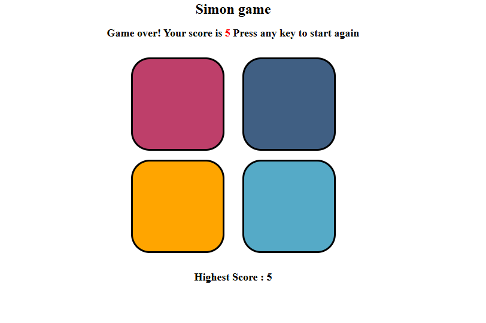

# Simon says game
This game is a very popular memory game called "simon says". where the user repeat the sequence of colors until they fail to remember the sequence.

## Features ✨
- ✅ Easy to use
- 🎨 Minimal design 
- 🏆 Displays Top score 

## How to Play 🎮
1. To **start the game** press any key on your keyboard.

2. The User needs to press the correct sequence of colors with respect to the random color generation. 

3. Each time when you press the right sequence of colors, you will advance to the **next level**

4. **Repeat the process** until you fail to press the right sequence.

5. All this while your top score (max level reached)  will be displayed. 

## Technologies Used 🛠️
- HTML  
- CSS 
- Javascript

## Game Screenshots
### Starting screen:

 

### Game Over screen:

